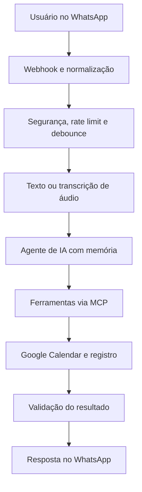

# Meeting Room Booking AI Agent with n8n

> Agente inteligente no WhatsApp para consultar disponibilidade, agendar, reagendar e cancelar salas de reunião com n8n, IA, MCP e Google Calendar.

[](https://n8n.io/)
[](https://calendar.google.com/)
[](#)
[](https://redis.io/)
[](LICENSE)

## Visão geral

Este projeto demonstra a arquitetura de um assistente conversacional para gerenciamento de salas de reunião. A solução recebe mensagens de texto ou áudio pelo WhatsApp, interpreta a intenção do usuário e utiliza ferramentas especializadas para consultar disponibilidade, criar reservas, listar reuniões futuras, reagendar e cancelar eventos.

O repositório contém uma **versão pública, demonstrativa e sanitizada**. Prompts de produção, nomes reais de salas, domínios corporativos, números de telefone, endpoints, identificadores, credenciais e regras empresariais foram deliberadamente removidos.

## Problema resolvido

Reservas de salas normalmente exigem consulta manual de agendas, troca de mensagens e conferência de conflitos. O assistente transforma esse processo em uma conversa simples:

- “Quero reservar uma sala amanhã à tarde.”
- “Quais reuniões tenho agendadas?”
- “Mude minha reunião para outro horário.”
- “Cancele a reserva de sexta-feira.”
- “Essa sala está livre às 15h?”

## Arquitetura



A implementação de produção separa a camada conversacional do workflow de ferramentas. Rotinas agendadas também verificam lembretes, conclusão de reuniões e cancelamentos feitos diretamente no calendário.

## Principais capacidades

- Atendimento pelo WhatsApp em português
- Entrada por texto e áudio
- Transcrição de mensagens de voz
- Consulta de disponibilidade de salas
- Criação, listagem, reagendamento e cancelamento de reservas
- Integração com Google Calendar
- Ferramentas desacopladas por MCP
- Memória de conversa em PostgreSQL
- Debounce de mensagens com Redis
- Rate limiting por usuário
- Lembretes automáticos antes das reuniões
- Sincronização de cancelamentos manuais
- Atualização de status e registro de falhas
- Validação antes de confirmar qualquer operação

## Tecnologias

- n8n
- Google Calendar
- MCP (Model Context Protocol)
- LLMs e prompt engineering
- WhatsApp
- Redis
- PostgreSQL
- JavaScript
- Webhooks e APIs REST
- JSON

## Conteúdo do repositório

```text
.
├── workflows/
│   ├── room-booking-agent-demo.json
│   └── room-booking-mcp-demo.json
├── docs/
│   ├── architecture.md
│   └── publishing-checklist.md
├── examples/
│   └── sample-conversation.md
├── .gitignore
├── LICENSE
├── SECURITY.md
└── README.md
```

## Como explorar

1. Leia [a arquitetura](docs/architecture.md).
2. Consulte o [exemplo fictício de atendimento](examples/sample-conversation.md).
3. Importe os JSONs da pasta `workflows` no n8n para visualizar a arquitetura demonstrativa.
4. Observe os nós marcados como lógica proprietária ou integração privada omitida.

> Os workflows públicos não são uma solução pronta para produção. Eles não contêm credenciais, endpoints operacionais, prompts completos, catálogo real de salas, regras corporativas nem integrações ativas.

## Limites da versão pública

| Disponível | Omitido |
|---|---|
| Arquitetura geral | Prompt completo do agente |
| Separação entre agente e MCP | Credenciais e endpoints |
| Ações conceituais de agendamento | Nomes e calendários reais |
| Conversas e reservas fictícias | Telefones e e-mails reais |
| Nós demonstrativos importáveis | Regras corporativas |
| Boas práticas de segurança | IDs, tabelas e mapeamentos |
| Descrição das automações | Código operacional completo |

## Segurança

Credenciais do Google Calendar, WhatsApp, Redis, PostgreSQL e provedores de IA nunca devem ser gravadas diretamente em workflows exportados. Utilize o gerenciador de credenciais do n8n ou variáveis de ambiente, aplique menor privilégio e valide a identidade do usuário antes de consultar ou alterar reservas.

Consulte [SECURITY.md](SECURITY.md) e o [checklist de publicação](docs/publishing-checklist.md).

## Autor

Desenvolvido por [Marcelo](https://github.com/marceloleicam) como projeto de portfólio em Automação, Inteligência Artificial, integração de sistemas e experiência conversacional.

## Licença

Uso exclusivo para avaliação e demonstração de portfólio. Cópia, redistribuição, modificação ou exploração comercial não são autorizadas sem permissão prévia. Consulte [LICENSE](LICENSE).
