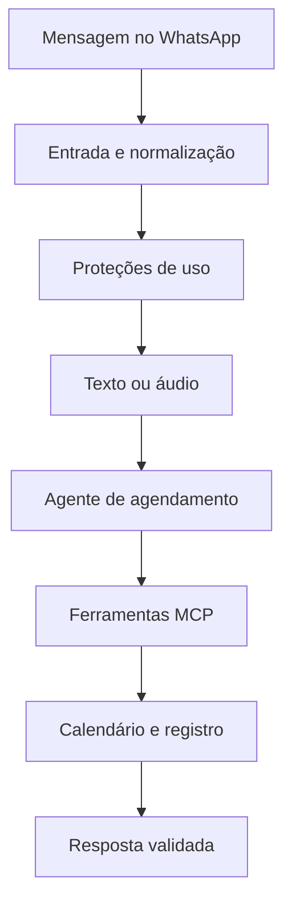
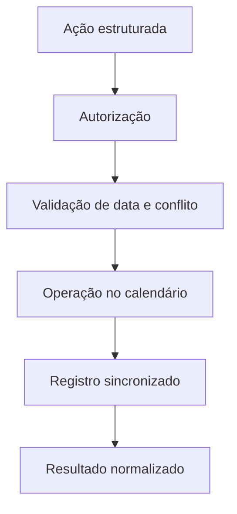

# Arquitetura da solução

## Visão funcional

## Workflow do assistente

A camada conversacional recebe o evento do WhatsApp, rejeita mensagens inválidas,
normaliza texto ou áudio e prepara uma solicitação única para o agente.

Na implementação de produção, essa camada também contém:

- bloqueio de mensagens enviadas pelo próprio bot e de conversas em grupo;
- rate limiting por usuário;
- debounce para agrupar mensagens consecutivas;
- transcrição de áudio;
- memória de conversa em PostgreSQL;
- validação do retorno antes do envio;
- resposta de contingência e registro de falhas.

Prompts, chaves de sessão, regras completas e configurações operacionais não são
publicados.

## Workflow de ferramentas MCP

As operações de calendário ficam isoladas em um workflow próprio. A camada MCP
recebe uma ação estruturada, valida a identidade e os dados da solicitação,
executa a operação autorizada e normaliza o resultado.

Ações conceituais:

- consultar disponibilidade;
- criar reserva;
- listar reuniões futuras do próprio usuário;
- reagendar reserva;
- cancelar reserva;
- atualizar o status da reunião.

A separação reduz o acoplamento entre a conversa e o calendário, evita que o
agente acesse diretamente integrações sensíveis e facilita manutenção.

## Automações agendadas

A solução de produção possui rotinas independentes para:

1. localizar reuniões próximas e enviar um único lembrete;
2. marcar como concluídas as reuniões cujo horário final passou;
3. detectar eventos removidos manualmente do calendário;
4. confirmar a ausência antes de cancelar o registro;
5. avisar o responsável quando uma exclusão manual for confirmada.

Redis é usado para evitar notificações duplicadas e o registro persistente
mantém o estado das reservas.

## Segurança

Uma implementação real deve manter fora dos workflows públicos:

- credenciais do Google Calendar, WhatsApp, Redis, PostgreSQL e provedor de IA;
- endpoint MCP, webhooks e nomes de instâncias;
- nomes e identificadores reais de salas;
- calendários, tabelas, telefones e e-mails;
- lista de domínios corporativos;
- prompt completo e regras internas;
- IDs de eventos e dados de reuniões;
- limites, chaves e estratégias operacionais.

Toda consulta, alteração ou exclusão deve ser vinculada à identidade verificada
do solicitante. O agente não deve listar nem modificar reservas de terceiros.

## Fronteira público × privado

| Camada | Versão pública | Produção privada |
|---|---|---|
| WhatsApp | Webhook conceitual | Endpoint, instância e mídia reais |
| Entrada | Normalização fictícia | Extração e filtros completos |
| Proteções | Nós indicativos | Rate limit, debounce e chaves Redis |
| Agente | Nó explicativo | Prompt, memória e regras |
| MCP | Ações conceituais | Endpoint e ferramentas operacionais |
| Calendário | Integração omitida | Credenciais, calendários e salas |
| Persistência | Resultado fictício | Tabelas, logs e IDs reais |
| Notificações | Arquitetura documentada | Rotinas, horários e destinatários |
